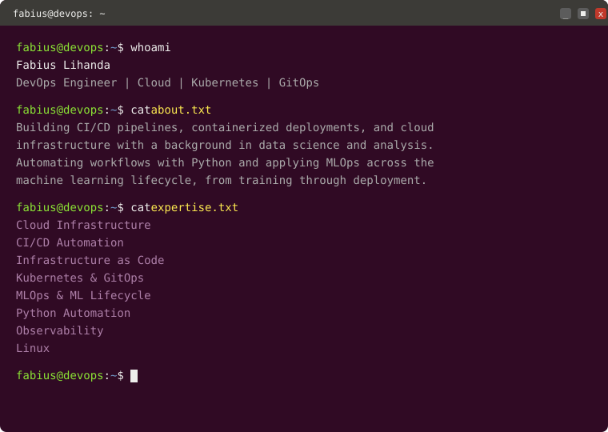

<h1 align="center">Fabius Lihanda</h1>

<p align="center">
  
</p>

<p align="center">
  
</p>

<p align="center">━━━━━━━━━━━━━━━━━━━━━━━━━━━━━━━━━━━━━━━━━━━━━━━━━━━━━━</p>

### Tech Stack

```text
Cloud & Infra    AWS · Azure · Terraform · Docker · Kubernetes · Linux
CI/CD            Jenkins · GitHub Actions · Azure DevOps · GitOps
Config Mgmt      Ansible
Observability    Prometheus · Grafana
Data & ML        Python · SQL · Databricks · Azure ML · MLflow
Web              Flask · Django
```

<p align="center">━━━━━━━━━━━━━━━━━━━━━━━━━━━━━━━━━━━━━━━━━━━━━━━━━━━━━━</p>


### Contact

```text
LinkedIn   linkedin.com/in/fabius-lihanda
Email      fabiuslihandaachevi@gmail.com
GitHub     github.com/lihandafabius
Medium     https://medium.com/@fabiuslihandaachevi
```

<p align="center"><sub>Thanks for stopping by.</sub></p>
